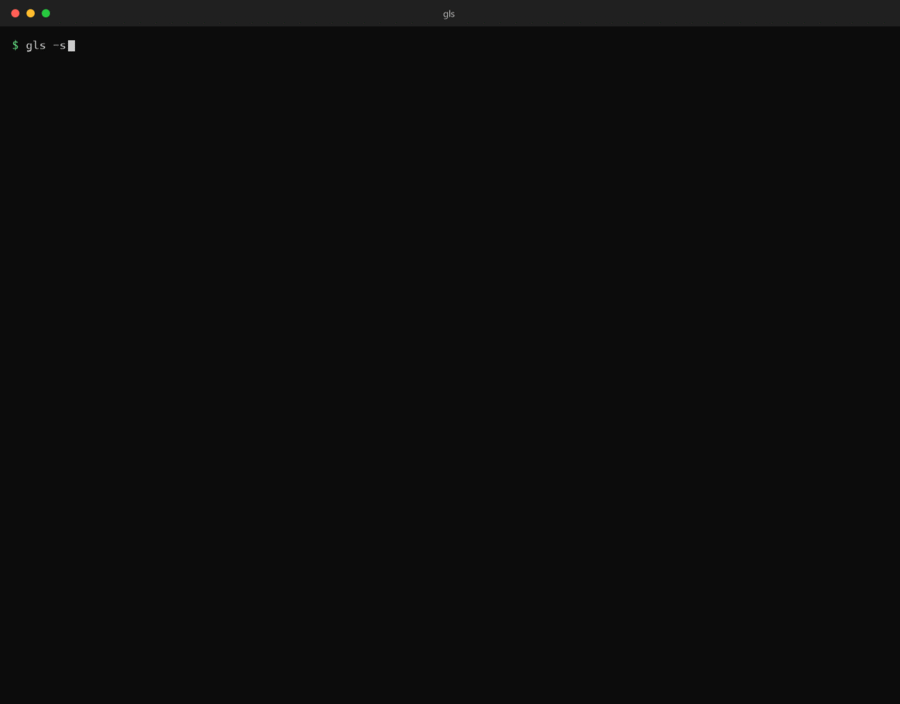
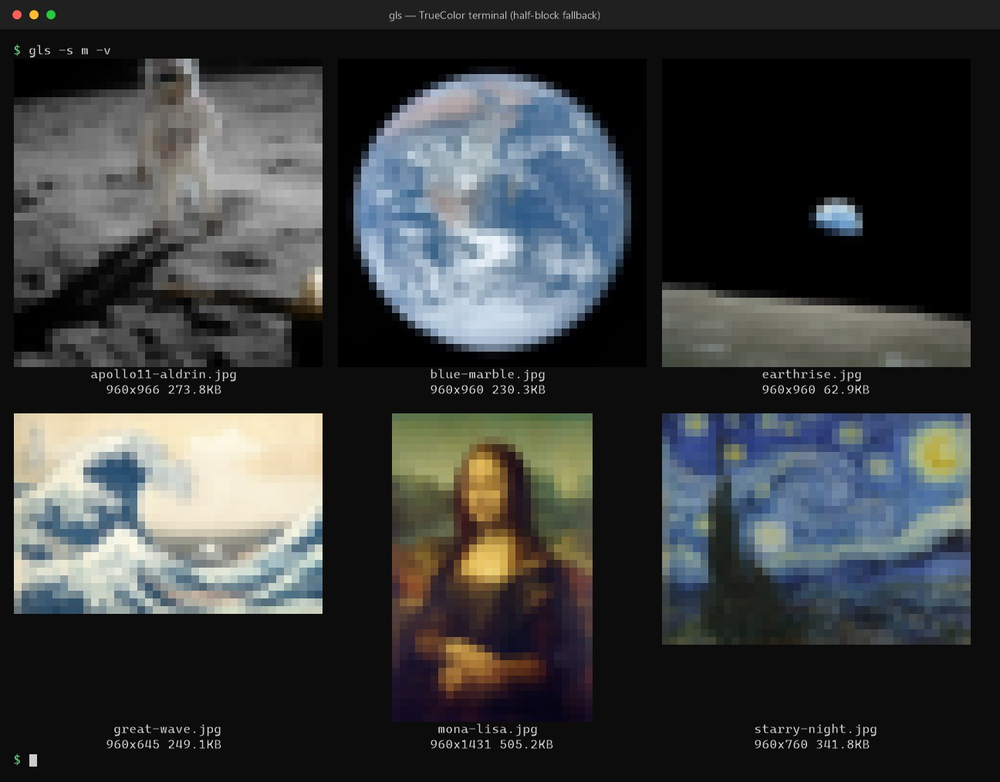
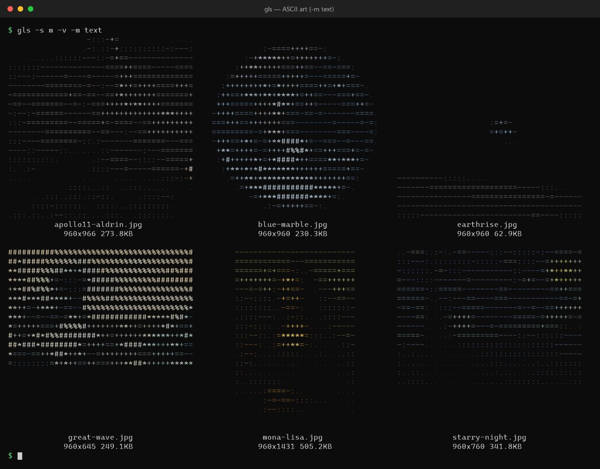

# gls

**English** | [日本語](README_JA.md)

**`ls` for images.** List the images in a folder as thumbnails with file names, right in your terminal.

- Shows real images through the terminal's image protocols (**Sixel / Kitty / iTerm2**). On terminals without one, it falls back automatically to **half-block** rendering (TrueColor / 256 colors) and then to **ASCII art**
- Supports PNG, JPEG, GIF, WebP, TIFF, BMP, **SVG**, **video**, **PDF** and **HEIC**
- Regex filtering, sorting, limiting the count, recursion, EXIF orientation, and detailed info (EXIF and more) with `-vv`
- File names are hyperlinks: `Ctrl+click` opens the file in its default app (OSC 8)
- Parallel decoding, read-ahead and a cache keep it fast even with thousands of images
- Windows, macOS and Linux (including WSL); prebuilt binaries on the [Releases page](https://github.com/equinox79/gls/releases)
- Scriptable: `--json` for structured output, `-0` for `xargs -0`, and `-l` for an `ls -l` style listing
- Messages in 10 languages (English, 日本語, 简体中文, 繁體中文, 한국어, Español, Français, Deutsch, Português (Brasil), Русский), chosen from your environment; more languages are easy to add (see [Languages](#languages))



<sub>`gls -s m -v` in a terminal that supports an image protocol (real images, not characters), then `-vv`, `-m half` and `-m text`. The six sample pictures are in the public domain, see [docs/CREDITS.md](docs/CREDITS.md). Every frame was rendered from the real output of `gls`; this is not a screen recording, and the typing is simulated.</sub>

## Install

### Option 1: download a binary (no Rust needed)

Download the archive for your OS from the [Releases page](https://github.com/equinox79/gls/releases), unpack it, and put `gls` (`gls.exe` on Windows) in a folder on your `PATH`.

| OS | File |
| --- | --- |
| Windows (x64) | `gls-<version>-x86_64-pc-windows-msvc.zip` |
| macOS (Apple silicon) | `gls-<version>-aarch64-apple-darwin.tar.gz` |
| macOS (Intel) | `gls-<version>-x86_64-apple-darwin.tar.gz` |
| Linux / WSL (x64) | `gls-<version>-x86_64-unknown-linux-gnu.tar.gz` |
| Linux (ARM64) | `gls-<version>-aarch64-unknown-linux-gnu.tar.gz` |

`SHA256SUMS` on the same page lists the checksums. The macOS binaries are not signed; if macOS refuses to open one, run `xattr -d com.apple.quarantine gls` once. The Linux builds need glibc 2.35 or newer (Ubuntu 22.04 and later).

To see video, PDF or HEIC thumbnails you may need a few extra tools: see [Optional: tools for video, PDF and HEIC](#optional-tools-for-video-pdf-and-heic) below.

### Option 2: build from source

#### 1. Set up Rust and a C linker

gls is built with [Rust](https://rustup.rs/). Rust needs your platform's linker, so install that first.

**macOS**

```bash
xcode-select --install                                          # Xcode Command Line Tools (linker)
curl --proto '=https' --tlsv1.2 -sSf https://sh.rustup.rs | sh  # Rust
```

**Linux / WSL** (Debian / Ubuntu; on other distributions install the equivalent of `build-essential`)

```bash
sudo apt install build-essential curl                           # C compiler and linker
curl --proto '=https' --tlsv1.2 -sSf https://sh.rustup.rs | sh  # Rust
```

**Windows**

```powershell
winget install Rustlang.Rustup
```

Rust on Windows needs the Visual Studio C++ Build Tools. If they are missing, `rustup` offers to install them; choose "Desktop development with C++".

Open a new terminal afterwards so that `cargo` is on `PATH`.

#### 2. Install gls

```bash
cargo install --git https://github.com/equinox79/gls
```

From source:

```bash
git clone https://github.com/equinox79/gls
cd gls
cargo install --path .
```

To see video, PDF or HEIC thumbnails you may need a few extra tools: see the next section, [Optional: tools for video, PDF and HEIC](#optional-tools-for-video-pdf-and-heic).

### Optional: tools for video, PDF and HEIC

Images and SVG work without anything else. Video, PDF and HEIC/AVIF need a way to make thumbnails, and gls tries these in order: **the OS thumbnail first, then external tools found on `PATH`** (see [Supported formats](#supported-formats)). So what you have to install depends on your OS:

| | Video | PDF | HEIC / AVIF | Video details (`-vv`, `-l`, `--json`) |
| --- | --- | --- | --- | --- |
| **macOS** | Quick Look | Quick Look | Quick Look | `ffprobe` (comes with ffmpeg) |
| **Windows** | Explorer thumbnails | Explorer thumbnails, **only if a PDF thumbnail handler is installed** (Adobe Acrobat, PDF-XChange and others do it; plain Windows does not). Otherwise `mutool`, `pdftoppm` or ImageMagick | "HEIF Image Extensions" from the Microsoft Store, or ImageMagick / `ffmpeg` | `ffprobe` |
| **Linux / WSL** | `ffmpeg` | `mutool`, `pdftoppm` or ImageMagick | ImageMagick 7 (`magick`) or an `ffmpeg` that can read HEIF | `ffprobe` |

If a tool is missing, the cell shows "(load failed)" and **one warning that names the missing tool** is printed. You do not need all of them: install only what you use.

**Install commands** (copy and paste; each block is only what that platform needs)

macOS (Homebrew), all optional because Quick Look already makes the thumbnails:

```bash
brew install ffmpeg mupdf poppler imagemagick
```

Windows (winget):

```powershell
winget install Gyan.FFmpeg                # video thumbnails and video details (ffmpeg, ffprobe)
winget install oschwartz10612.Poppler     # PDF thumbnails (pdftoppm)
winget install ImageMagick.ImageMagick    # HEIC / AVIF, and PDF as a last resort
```

Windows (Scoop):

```powershell
scoop install ffmpeg mupdf                # mupdf provides mutool (PDF)
```

Debian / Ubuntu / WSL:

```bash
sudo apt install ffmpeg mupdf-tools poppler-utils
```

Fedora (for all video codecs, take `ffmpeg` from RPM Fusion instead of `ffmpeg-free`):

```bash
sudo dnf install ffmpeg-free mupdf poppler-utils ImageMagick
```

Arch:

```bash
sudo pacman -S ffmpeg mupdf-tools poppler imagemagick
```

Open a new terminal afterwards so that the commands are on `PATH`, then check that they are found:

```bash
ffmpeg -version     # video thumbnails
ffprobe -version    # video details
mutool -v           # PDF (or: pdftoppm -v)
magick -version     # HEIC / AVIF (ImageMagick 7)
```

> Ubuntu and Debian ship ImageMagick 6 as `imagemagick`. It has no `magick` command, so gls does not use it; for HEIC/AVIF on those systems use an `ffmpeg` that can read HEIF, or install ImageMagick 7 yourself.

> **About the name:** on macOS, Homebrew's `coreutils` installs GNU `ls` as `gls`.
> If that conflicts, rename the installed binary after `cargo install`, or use a shell alias.

## Usage

```bash
gls                                      # no arguments: thumbnails of the current directory
gls photo.jpg                            # show one image
gls ./*                                  # thumbnails of the images in the current directory
gls photos/ -s m                         # bigger thumbnails
gls . -R -e '\.png$' --sort date -n 20   # PNGs in subfolders, newest 20
gls ./* -vv                              # also show format, EXIF and other details under each name
```

- Without arguments, `gls` lists the current directory. Pass several images to get a thumbnail list. Wildcards and directories work too (`*` works in PowerShell and cmd as well). Files that are not images are ignored.
- When the output is taller than the screen, it pauses one screen at a time like `more` (`Space`/`f`/`PageDown`: next screen, `Enter`/`j`/`↓`: one line, `q`/`Esc`/`Ctrl+C`: quit). It does not pause when piped or redirected.
- Long file names wrap to at most 3 lines within the thumbnail width. If they still do not fit, the last line is shortened but keeps the extension, like `...png`.
- Thumbnails are laid out side by side as far as the terminal width allows (set the columns with `-g COLSxROWS`).
- If the next output takes longer than 0.15 s, a progress indicator such as `⠋ loading 12/86` appears on stderr (not when redirected).

## Options

### Filtering and sorting

| Option | Description |
| --- | --- |
| `-e`, `--regexp <REGEX>` | Filter by file name (without the directory part) using a regular expression. Repeat the option to match any of several patterns. Add `(?i)` to ignore case, e.g. `-e '(?i)\.jpe?g$'` |
| `-R`, `--recursive` | Also search subdirectories (hidden directories such as `.git` are skipped). The parent directory name is shown before the file name |
| `--max-depth <N>` | How deep to descend (`0`: only the given directory, `1`: one level down). Implies recursion even without `-R` |
| `--sort <KEY>` | `name` (default; ascending, digits compared as numbers so `img2` < `img10`), `date` (modified time, newest first), `size` (largest first), `exif-date` (EXIF capture time, newest first; falls back to modified time), `none` (keep the given order) |
| `-r`, `--reverse` | Reverse the order |
| `-n`, `--head <N>` | After sorting, show only the first N images |

### Size and layout

| Option | Description |
| --- | --- |
| `-s`, `--size <xs\|s\|m\|l\|xl>` | Size preset (default: `s`). A single image is 24/40/80/120/160 columns wide; in a list, each thumbnail is 12/20/40/60/80 columns wide |
| `-w`, `--width <N>` | Width in columns (cannot be combined with `--size`). In a list, the width of the whole output |
| `-g`, `--grid <COLSxROWS>` | Grid of a list. If omitted, as many columns as fit the terminal width are used (2 rows). With only `--width`, it is `3x2` |
| `-v`, `-vv` | Show image info under each name. `-v`: pixel size and file size. `-vv`: also format, color, megapixels, aspect ratio, modified date and EXIF (camera, aperture, shutter speed, ISO, focal length, capture date, whether GPS is present). Items that cannot be read are omitted |

### Long listing

| Option | Description |
| --- | --- |
| `-l`, `--long` | Long listing like `ls -l`: one line per file with size, dimensions, megapixels, aspect ratio, format and color, modified date, EXIF capture time, camera, shooting settings (aperture, shutter speed, ISO, focal length; for video: length and codec) and whether GPS data is present. No thumbnails unless you add `--thumbs`. Columns with nothing to show are left out, and `-` marks a missing value. Filtering, sorting, `-R` and `-n` work as usual. The header and the links are added only on a terminal |
| `--thumbs` | With `-l`, show a thumbnail of each image to the left of its details (see below). Implies `-l` |

```
$ gls -l
273.8KB   960x966  0.9MP  0.99:1  JPEG RGB 8bit  2026-10-08 11:24  apollo11-aldrin.jpg
230.3KB   960x960  0.9MP  1:1     JPEG RGB 8bit  2026-10-08 11:24  blue-marble.jpg
 62.9KB   960x960  0.9MP  1:1     JPEG RGB 8bit  2026-10-08 11:24  earthrise.jpg
249.1KB   960x645  0.6MP  1.49:1  JPEG RGB 8bit  2026-10-08 11:24  great-wave.jpg
505.2KB  960x1431  1.4MP  0.67:1  JPEG RGB 8bit  2026-10-08 11:24  mona-lisa.jpg
341.8KB   960x760  0.7MP  24:19   JPEG RGB 8bit  2026-10-08 11:24  starry-night.jpg
```

Photos with EXIF also get the capture time, camera, and shooting settings (e.g. `f/11 1/125s ISO100 16mm`) columns. This example is piped; on a terminal a bold header line is added.

With `--thumbs`, each file becomes a small card instead: the thumbnail on the left, and on the right the name, then size / dimensions / format, then dates and EXIF (values that exist, one group per line). `--thumbs` includes `-l`, and `-s xs|s|m|l|xl` sets the card height (3/4/5/7/9 lines). It uses the same rendering as the thumbnail list, so it falls back to half blocks and ASCII art in the same way.

```
gls -l --thumbs -s m
```

### Scripting

| Option | Description |
| --- | --- |
| `--json` | Print the matching files as JSON and exit: one array with one object per file. Filtering, sorting, `-R` and `-n` work as usual. Cannot be combined with `-l` / `--thumbs` / `-0` |
| `-0`, `--null` | Print only the matching file paths, separated by NUL characters (like `find -print0`), and exit. For `xargs -0`. Paths are written byte for byte |

```
$ gls --json tests/data/gradient.png
[
{"path":"tests/data/gradient.png","name":"gradient.png","type":"image","bytes":2571,"width":96,"height":64,"megapixels":0.01,"aspect":"3:2","format":"PNG","color":"RGBA 8bit","modified":"2026-10-08T11:05:04.335445900+09:00","details":[],"exif":null}
]
```

Every object has the same keys, and `null` means "not available":

| Key | Meaning |
| --- | --- |
| `path`, `name` | The path as gls found it, and the file name |
| `type` | `image`, `svg`, `video`, `pdf` or `heif` |
| `bytes`, `width`, `height`, `megapixels`, `aspect` | Numbers (`aspect` is a string such as `16:9`). `null` for video, PDF and HEIC, whose size is not read |
| `format`, `color` | e.g. `JPEG`, `RGB 8bit` |
| `modified` | Modified time in RFC 3339 |
| `details` | Video length, codec and so on (needs `ffprobe`); empty otherwise |
| `exif` | `null`, or an object with `camera`, `aperture`, `exposure`, `iso`, `focal_length`, `taken` (strings as stored in the file, e.g. `f/11`, `1/125s`, `ISO100`) and `gps` (boolean) |

```bash
# Photos taken with a given camera, with their capture time
gls --json -R photos | jq -r '.[] | select(.exif.camera // "" | test("SONY")) | [.exif.taken, .path] | @tsv'

# The 20 newest PNGs, copied somewhere (file names with spaces are fine)
gls -0 -R -e '\.png$' --sort date -n 20 | xargs -0 cp -t backup/
```

Warnings and errors go to standard error, so they never get mixed into this output.

### Rendering
| Option | Description |
| --- | --- |
| `-m`, `--mode <image\|half\|text>` | Rendering mode (default: `image`; falls back automatically on terminals that cannot use it, see below) |
| `--protocol <auto\|sixel\|kitty\|iterm2>` | Image protocol (default: `auto`) |
| `--cell-size <WxH>` | Pixel size of one character cell, e.g. `10x20`. Adjust it when images and file names are misaligned with Sixel |
| `-p`, `--palette <NAME>` | Character set for `text` mode: `standard` `block` `simple` `binary` `retro` `dots` |
| `--custom-palette <CHARS>` | Any character set, from dark to light (takes precedence over `--palette`) |
| `-i`, `--invert` | Invert brightness (`text` mode) |
| `--contrast <F>` / `--gamma <F>` | Contrast and gamma adjustment (default `1.0`) |
| `--no-color` | No color (monochrome `text` mode) |
| `--no-links` | Do not add hyperlinks to file names |
| `--no-pager` | Do not pause even when the output does not fit the screen |
| `--lang <CODE>` | Language of messages (`en`, `ja`, `zh-cn`, `zh-tw`, `ko`, `es`, `fr`, `de`, `pt-br`, `ru`). Default: detected from the environment, see [Languages](#languages) |

### Cache

| Option | Description |
| --- | --- |
| `--no-cache` | Do not use the render cache |
| `--cache-max-mb <MB>` | Cache size limit (default 256; environment variable `GLS_CACHE_MAX_MB`). The oldest entries beyond it are removed right away |
| `--cache-days <DAYS>` | Remove entries unused for this many days (default 30; environment variable `GLS_CACHE_DAYS`) |
| `--cache-info` | Show where the cache is, how many files and how much space it uses (by kind), the oldest / newest last-used age, and the limits, then exit |
| `--clear-cache` | Delete the whole render cache and exit |

## Rendering modes and fallback

The default `image` mode switches automatically, depending on what the terminal supports.
The switch is silent by default; you get a warning only when you ask for `-m image` explicitly and it cannot be used.

1. **`image`**: terminals with Sixel / Kitty / iTerm2
2. **`half` (TrueColor)**: draws two pixels per character with the half block `▀`. For TrueColor terminals (Windows, `COLORTERM=truecolor`, well-known terminals)
3. **`half` (256 colors)**: terminals whose `TERM` is `*256color`
4. **`text` (monochrome)**: ASCII art that uses character density. For everything else

The same folder, on a terminal without an image protocol (`half`, left) and with `-m text` (right, ASCII art):

| `half` (TrueColor) | `-m text` |
| --- | --- |
|  |  |

With an explicit `-m half` or `-m text`, no detection is done and that mode is used.

The image protocol is detected from environment variables:

| Terminal | Protocol |
| --- | --- |
| Kitty, Ghostty | Kitty |
| iTerm2, WezTerm | iTerm2 |
| Windows Terminal (also inside WSL, 1.22 or later), foot, mlterm | Sixel |

If your terminal is not detected, choose a protocol with `--protocol sixel` and so on. It may not work through tmux.

## Supported formats

- **Images:** PNG, JPEG, GIF, BMP, WebP, TIFF, ICO, TGA, QOI. EXIF orientation (JPEG and others) is applied.
- **SVG:** rendered directly (no external tools; white background; `<text>` is not rendered).
- **Video (mp4, mov, mkv, webm, avi, m4v, wmv, flv, mpg, 3gp), PDF (first page), HEIC / HEIF / AVIF:** a way to make thumbnails is required. These are tried in order:
  1. **The OS thumbnail:** on Windows, the same as Explorer (video works out of the box; PDF only if a PDF thumbnail handler such as Adobe Acrobat or PDF-XChange is installed; for HEIC install "HEIF Image Extensions" from the Microsoft Store). See [the tools for video, PDF and HEIC](#optional-tools-for-video-pdf-and-heic); on macOS, Quick Look
  2. **External tools** (used if they are on `PATH`): `ffmpeg` for video; `mutool`, then `pdftoppm`, then ImageMagick for PDF; ImageMagick (`magick`), then `ffmpeg` for HEIC/AVIF

  If none works, the cell shows "(load failed)" and a warning that names the missing tool is printed once.

## File name links

On supported terminals (Windows Terminal, iTerm2, WezTerm, Kitty, GNOME Terminal, VS Code and others), each file name is a link
that opens in the default app with `Ctrl+click` (`Cmd+click` on macOS), using OSC 8 hyperlinks.
No links are added when the output is not a terminal (redirected or piped).

In WSL, `/mnt/c/...` is converted to `C:/...` and other paths to `\\wsl.localhost\<distro>\...`, so they open in Windows apps.

## Performance

- A list decodes and renders several images in parallel. It starts showing as soon as the first row is ready and reads a few rows ahead.
- JPEG is decoded while scaling down to 1/2, 1/4 or 1/8. In a list, the EXIF thumbnail (about 160 px) is used when it is large enough, so the full image is not read at all.
- Rendered output is cached. If the image path, modified time, size and display settings are the same, the next run does not decode the image again. In `image` mode, the downscaled thumbnails of video, PDF, HEIC/AVIF and SVG (the slow ones) are cached too, so ffmpeg and the like are not run again. Only lists are cached: a single image (`gls video.mp4`) is always rebuilt. Use `--cache-info` to see what is cached.
  - Location: `%LOCALAPPDATA%\gls\cache` on Windows, `~/.cache/gls/cache` on Linux / macOS (`XDG_CACHE_HOME` takes precedence)
  - Old cache entries are cleaned up once a day in the background at startup: entries unused for 30 days, and the oldest entries beyond a total of 256 MB. Change the limits with the options `--cache-days` and `--cache-max-mb` (applied right away) or the environment variables `GLS_CACHE_DAYS` and `GLS_CACHE_MAX_MB` (applied at the next daily cleanup). Options take precedence over the environment variables.

## Notes on environments

- When you redirect with `> file.txt`, Windows PowerShell 5 writes UTF-16. Use PowerShell 7 for UTF-8.
- The legacy Windows console (conhost) also gets ANSI output enabled automatically, but it has no image protocol, so `half` is used.
- On slow file systems such as `/mnt/c` in WSL, `-m half` or `-s xs` is faster (the EXIF thumbnail can be used).
- When the output is not a terminal (piped), the width is taken from the `COLUMNS` environment variable (default 80).

## Development

```bash
cargo build --release
cargo test            # unit tests + tests/cli.rs (shows the small synthetic images in tests/data)
cargo fmt --check
cargo clippy --all-targets -- -D warnings
```

Source layout:

| File | Contents |
| --- | --- |
| `src/main.rs` | Arguments, expanding inputs, sorting, drawing the list, the pager |
| `src/gfx.rs` | Sixel / Kitty / iTerm2 output and terminal detection |
| `src/ext.rs` | SVG, video, PDF and HEIC (OS thumbnails, external tools) |
| `src/info.rs` | Image info for `-v` / `-vv` |
| `src/orient.rs`, `src/thumb.rs` | EXIF orientation and EXIF thumbnails |
| `src/link.rs` | File name hyperlinks (OSC 8) |
| `src/i18n.rs`, `locales/*.txt` | Language selection and message catalogs |

## Languages

Help, warnings, errors and the info labels are available in these languages. English is the default and the reference; the others were machine-translated, so corrections are very welcome (pull requests that fix a `locales/<code>.txt` file are the easiest).

| Code | Language | Code | Language |
| --- | --- | --- | --- |
| `en` | English | `es` | Español |
| `ja` | 日本語 | `fr` | Français |
| `zh-cn` | 简体中文 | `de` | Deutsch |
| `zh-tw` | 繁體中文 | `pt-br` | Português (Brasil) |
| `ko` | 한국어 | `ru` | Русский |

Regional names are understood: `pt_BR.UTF-8`, `zh-Hant-TW` or `zh_HK` pick the closest catalog (`pt` gives `pt-br`, `zh` and `zh-Hans` give `zh-cn`, `zh-HK` and `zh-Hant` give `zh-tw`).
The language is chosen in this order:

1. `--lang <code>` (e.g. `--lang ja`)
2. the environment variables `GLS_LANG`, `LC_ALL`, `LC_MESSAGES`, `LANG` (e.g. `ja_JP.UTF-8`)
3. the display language of Windows
4. English

Anything not translated falls back to English. (`--help` also keeps clap's own words, such as `Usage:`, in English.)

**Adding a language:**

1. Copy `locales/en.txt` to `locales/<code>.txt` (lower case, e.g. `fr`, `zh-cn`) and translate the messages. Keep every `{placeholder}` as it is.
2. Add one line to `CATALOGS` in `src/i18n.rs`: `("fr", include_str!("../locales/fr.txt")),`
3. Run `cargo test`. It checks that every key and placeholder matches `en.txt`.

## License

[MIT](LICENSE)
