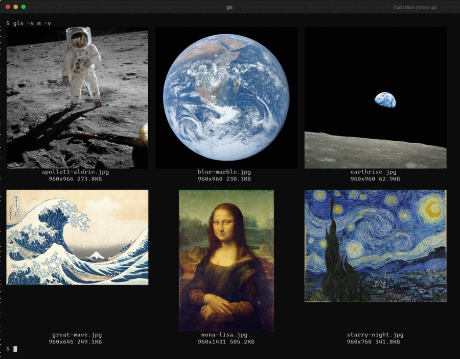
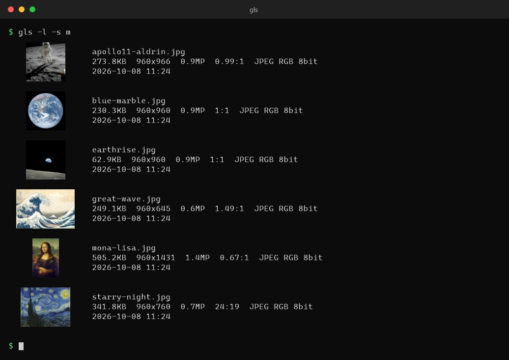

# gls

**English** | [日本語](README_JA.md)

[](https://github.com/equinox79/gls/actions/workflows/ci.yml)
[](LICENSE)
[](https://github.com/equinox79/gls/releases/latest)

**`ls`, with pictures.**
An `ls`-style lister that shows thumbnails of images, videos and PDFs in your terminal. `Ctrl+click` a name to open the file.


<sub>`gls -s m -v` in a terminal that supports an image protocol (real images, not characters), then `-vv`, `-m half` and `-m text`. The six sample pictures are in the public domain, see [docs/CREDITS.md](docs/CREDITS.md). Every frame was rendered from the real output of `gls`; this is not a screen recording, and the typing is simulated.</sub>

## Quick start

```bash
cargo install --git https://github.com/equinox79/gls   # or download a binary: see Install
gls                  # thumbnails of the images in the current directory
gls -l               # a detailed list with a thumbnail on each line
```

## Features

- **Real images in the terminal** through Sixel, Kitty or iTerm2 graphics. Terminals without them fall back automatically to **half-block** characters (TrueColor / 256 colors), then to **ASCII art**
- **Many formats:** PNG, JPEG, GIF, WebP, TIFF, BMP, **SVG**, **video**, **PDF** and **HEIC**
- **Clickable file names:** `Ctrl+click` opens the file in your default app (OSC 8 hyperlinks)
- **Built for the `ls` workflow:** regex filter, sorting, recursion, EXIF orientation, `-vv` details, `-l` long listing with thumbnails
- **Scriptable:** `--json` for structured output, `-0` for `xargs -0`
- **Fast:** parallel decoding, read-ahead and a cache, even with thousands of images
- **Windows, macOS and Linux** (including WSL), with messages in **10 languages**

**Ctrl+click a file name and it opens in your default viewer.** File names are terminal hyperlinks (OSC 8), so this works in terminals that support them, such as Windows Terminal, iTerm2, WezTerm, Kitty, GNOME Terminal and VS Code (`Cmd+click` on macOS). In WSL the paths are converted so that Windows apps can open them. No links are added when the output is piped or redirected.



<sub>This is an illustration (mock-up), not a screen recording: the list is the real output of `gls`, but the mouse pointer, the tooltip and the viewer window are drawn to show the idea. What actually opens is the app your OS uses for that file type (Photos, Preview, an image viewer and so on).</sub>

### Why another image tool?

Tools such as [chafa](https://hpjansson.org/chafa/), [viu](https://github.com/atanunq/viu), [timg](https://github.com/hzeller/timg) and [lsix](https://github.com/hackerb9/lsix) already show images in a terminal very well. gls is built around the way you use `ls`: a listing with names and sizes, filtering and sorting by name, date or EXIF time, recursion, a long format, names you can click, and output you can pipe into other commands.

## Contents

- [Install](#install)
- [Usage](#usage)
- [Options](#options)
- [Rendering modes and fallback](#rendering-modes-and-fallback)
- [Supported formats](#supported-formats)
- [Status and known limitations](#status-and-known-limitations)
- [Performance and cache](#performance-and-cache)
- [Notes on environments](#notes-on-environments)
- [Development](#development) · [Languages](#languages) · [License](#license)

## Install

### Option 1: download a binary (no Rust needed)

Download the archive for your OS from the [Releases page](https://github.com/equinox79/gls/releases), unpack it, and put `gls` (`gls.exe` on Windows) in a folder on your `PATH`.

| OS | File (for version `v0.1.1`) |
| --- | --- |
| Windows (x64) | `gls-v0.1.1-x86_64-pc-windows-msvc.zip` |
| macOS (Apple silicon) | `gls-v0.1.1-aarch64-apple-darwin.tar.gz` |
| macOS (Intel) | `gls-v0.1.1-x86_64-apple-darwin.tar.gz` |
| Linux / WSL (x64) | `gls-v0.1.1-x86_64-unknown-linux-gnu.tar.gz` |
| Linux (ARM64) | `gls-v0.1.1-aarch64-unknown-linux-gnu.tar.gz` |

Copy and paste, for example on Linux (x64). Change `VERSION` and the target name for other platforms:

```bash
VERSION=0.1.1
TARGET=x86_64-unknown-linux-gnu
curl -L -o gls.tar.gz "https://github.com/equinox79/gls/releases/download/v$VERSION/gls-v$VERSION-$TARGET.tar.gz"
tar xzf gls.tar.gz
sudo install "gls-v$VERSION-$TARGET/gls" /usr/local/bin/
```

On Windows (PowerShell):

```powershell
$v = "0.1.1"
$t = "x86_64-pc-windows-msvc"
Invoke-WebRequest "https://github.com/equinox79/gls/releases/download/v$v/gls-v$v-$t.zip" -OutFile gls.zip
Expand-Archive gls.zip -DestinationPath .
# Next: put gls.exe on your PATH (see "Put gls.exe on your PATH" below)
```

`SHA256SUMS` on the same page lists the checksums. The macOS binaries are not signed. Downloaded with the `curl` command above, the Apple silicon one ran without a prompt; a file downloaded in a browser may be blocked by macOS: then run `xattr -d com.apple.quarantine gls` once. The Linux builds need glibc 2.35 or newer (Ubuntu 22.04 and later).

**Put `gls` on your `PATH` (macOS and Linux, bash or zsh)**

The `sudo install` command above puts `gls` in `/usr/local/bin`, which is already on your `PATH`. Without `sudo`, use a folder in your home directory such as `~/.local/bin`:

```bash
mkdir -p ~/.local/bin
```

```bash
cp "gls-v$VERSION-$TARGET/gls" ~/.local/bin/
```

Then add that folder to your `PATH` (run it once). Find out which shell you use with `echo $SHELL`.

zsh (the default on macOS):

```bash
echo 'export PATH="$HOME/.local/bin:$PATH"' >> ~/.zshrc
```

bash (on macOS use `~/.bash_profile` instead of `~/.bashrc`):

```bash
echo 'export PATH="$HOME/.local/bin:$PATH"' >> ~/.bashrc
```

Open a new terminal (or run `source ~/.zshrc` / `source ~/.bashrc`) and check:

```bash
gls --version
```

If it prints something else, or "command not found", look at which `gls` your shell finds:

```bash
which -a gls
```

On a Mac with Homebrew's `coreutils`, `/opt/homebrew/bin/gls` is GNU `ls`. Because the line above puts `~/.local/bin` first, this `gls` wins; to keep GNU `ls` as `gls`, call this one by its full path or give it another name.

**Put `gls.exe` on your `PATH` (Windows, PowerShell)**

Run this in the same PowerShell window as above (it uses `$v` and `$t`). It copies `gls.exe` to a folder in your profile and adds that folder to your user `PATH`. No administrator rights are needed.

```powershell
$dir = "$env:LOCALAPPDATA\Programs\gls"
New-Item -ItemType Directory -Force $dir | Out-Null
Copy-Item "gls-v$v-$t\gls.exe" $dir
```

```powershell
$old = [string][Environment]::GetEnvironmentVariable("Path", "User")
if (($old -split ';') -notcontains $dir) { [Environment]::SetEnvironmentVariable("Path", (($old.TrimEnd(';'), $dir | Where-Object { $_ }) -join ';'), "User") }
```

Open a new terminal (windows that are already open do not see the change), then check:

```powershell
gls --version
```

To use it right away in the current window, without opening a new one:

```powershell
$env:Path += ";$dir"
```

Prefer the Settings screen? Open the Start menu, search for "Edit environment variables for your account", select `Path`, choose Edit, then New, and paste the folder (for example `C:\Users\you\AppData\Local\Programs\gls`).
To see video, PDF or HEIC thumbnails you may need a few extra tools: see [Optional: tools for video, PDF and HEIC](#optional-tools-for-video-pdf-and-heic) below.

### Option 2: build from source

#### 1. Set up Rust and a C linker

gls is built with [Rust](https://rustup.rs/). Rust needs your platform's linker, so install that first.

**macOS**

```bash
xcode-select --install                                          # Xcode Command Line Tools (linker)
curl --proto '=https' --tlsv1.2 -sSf https://sh.rustup.rs | sh  # Rust
```

**Linux / WSL** (Debian / Ubuntu; on other distributions install the equivalent of `build-essential`)

```bash
sudo apt install build-essential curl                           # C compiler and linker
curl --proto '=https' --tlsv1.2 -sSf https://sh.rustup.rs | sh  # Rust
```

**Windows**

```powershell
winget install Rustlang.Rustup
```

Rust on Windows needs the Visual Studio C++ Build Tools. If they are missing, `rustup` offers to install them; choose "Desktop development with C++".

Open a new terminal afterwards so that `cargo` is on `PATH`.

#### 2. Install gls

```bash
cargo install --git https://github.com/equinox79/gls
```

From source:

```bash
git clone https://github.com/equinox79/gls
cd gls
cargo install --path .
```

`cargo install` puts `gls` in `~/.cargo/bin`, which the Rust installer already added to your `PATH`. If your shell says "command not found", add `~/.cargo/bin` the same way as in "Put `gls` on your `PATH`" under Option 1 (use `~/.cargo/bin` instead of `~/.local/bin`).

To see video, PDF or HEIC thumbnails you may need a few extra tools: see the next section, [Optional: tools for video, PDF and HEIC](#optional-tools-for-video-pdf-and-heic).

### Optional: tools for video, PDF and HEIC

Images and SVG work without anything else. Video, PDF and HEIC/AVIF need a way to make thumbnails, and gls tries these in order: **the OS thumbnail first, then external tools found on `PATH`** (see [Supported formats](#supported-formats)). So what you have to install depends on your OS:

| | Video | PDF | HEIC / AVIF | Video details (`-vv`, `-l`, `--json`) |
| --- | --- | --- | --- | --- |
| **macOS** | Quick Look | Quick Look | Quick Look | `ffprobe` (comes with ffmpeg) |
| **Windows** | Explorer thumbnails | Explorer thumbnails, **only if a PDF thumbnail handler is installed** (Adobe Acrobat, PDF-XChange and others do it; plain Windows does not). Otherwise `mutool`, `pdftoppm` or ImageMagick | "HEIF Image Extensions" from the Microsoft Store, or ImageMagick / `ffmpeg` | `ffprobe` |
| **Linux / WSL** | `ffmpeg` | `mutool`, `pdftoppm` or ImageMagick | ImageMagick 7 (`magick`) or an `ffmpeg` that can read HEIF | `ffprobe` |

If a tool is missing, the cell shows "(load failed)" and **one warning that names the missing tool** is printed. You do not need all of them: install only what you use.

**Install commands** (copy and paste; each block is only what that platform needs)

macOS (Homebrew), all optional because Quick Look already makes the thumbnails:

```bash
brew install ffmpeg mupdf poppler imagemagick
```

Windows (winget):

```powershell
winget install Gyan.FFmpeg                # video thumbnails and video details (ffmpeg, ffprobe)
winget install oschwartz10612.Poppler     # PDF thumbnails (pdftoppm)
winget install ImageMagick.ImageMagick    # HEIC / AVIF, and PDF as a last resort
```

Windows (Scoop):

```powershell
scoop install ffmpeg mupdf                # mupdf provides mutool (PDF)
```

Debian / Ubuntu / WSL:

```bash
sudo apt install ffmpeg mupdf-tools poppler-utils
```

Fedora (for all video codecs, take `ffmpeg` from RPM Fusion instead of `ffmpeg-free`):

```bash
sudo dnf install ffmpeg-free mupdf poppler-utils ImageMagick
```

Arch:

```bash
sudo pacman -S ffmpeg mupdf-tools poppler imagemagick
```

Open a new terminal afterwards so that the commands are on `PATH`, then check that they are found:

```bash
ffmpeg -version     # video thumbnails
ffprobe -version    # video details
mutool -v           # PDF (or: pdftoppm -v)
magick -version     # HEIC / AVIF (ImageMagick 7)
```

> Ubuntu and Debian ship ImageMagick 6 as `imagemagick`. It has no `magick` command, so gls does not use it; for HEIC/AVIF on those systems use an `ffmpeg` that can read HEIF, or install ImageMagick 7 yourself.

> **About the name:** on macOS, Homebrew's `coreutils` installs GNU `ls` as `gls`.
> If that conflicts, rename the installed binary after `cargo install`, or use a shell alias.

## Usage

```bash
gls                                      # no arguments: thumbnails of the current directory
gls photo.jpg                            # show one image
gls ./*                                  # thumbnails of the images in the current directory
gls photos/ -s m                         # bigger thumbnails
gls . -R -e '\.png$' --sort date -n 20   # PNGs in subfolders, newest 20
gls ./* -vv                              # also show format, EXIF and other details under each name
gls -l                                   # one card per file: thumbnail, name, size, dates, EXIF
gls -l --thumbs-off                      # the same details as a plain table, one line per file
gls --json -R photos | jq '.[].name'     # structured output for scripts
```

- Without arguments, `gls` lists the current directory. Pass several images to get a thumbnail list. Wildcards and directories work too (`*` works in PowerShell and cmd as well). Files that are not images are ignored.
- When the output is taller than the screen, it pauses one screen at a time like `more` (`Space`/`f`/`PageDown`: next screen, `Enter`/`j`/`↓`: one line, `q`/`Esc`/`Ctrl+C`: quit). It does not pause when piped or redirected.
- Long file names wrap to at most 3 lines within the thumbnail width. If they still do not fit, the last line is shortened but keeps the extension, like `...png`.
- Thumbnails are laid out side by side as far as the terminal width allows (set the columns with `-g COLSxROWS`).
- If the next output takes longer than 0.15 s, a progress indicator such as `⠋ loading 12/86` appears on stderr (not when redirected).

## Options

### Filtering and sorting

| Option | Description |
| --- | --- |
| `-e`, `--regexp <REGEX>` | Filter by file name (without the directory part) using a regular expression. Repeat the option to match any of several patterns. Add `(?i)` to ignore case, e.g. `-e '(?i)\.jpe?g$'` |
| `-R`, `--recursive` | Also search subdirectories (hidden directories such as `.git` are skipped). The parent directory name is shown before the file name |
| `--max-depth <N>` | How deep to descend (`0`: only the given directory, `1`: one level down). Implies recursion even without `-R` |
| `--sort <KEY>` | `name` (default; ascending, digits compared as numbers so `img2` < `img10`), `date` (modified time, newest first), `size` (largest first), `exif-date` (EXIF capture time, newest first; falls back to modified time), `none` (keep the given order) |
| `-r`, `--reverse` | Reverse the order |
| `-n`, `--head <N>` | After sorting, show only the first N images |

### Size and layout

| Option | Description |
| --- | --- |
| `-s`, `--size <xs\|s\|m\|l\|xl>` | Size preset (default: `s`). A single image is 24/40/80/120/160 columns wide; in a list, each thumbnail is 12/20/40/60/80 columns wide |
| `-w`, `--width <N>` | Width in columns (cannot be combined with `--size`). In a list, the width of the whole output |
| `-g`, `--grid <COLSxROWS>` | Grid of a list. If omitted, as many columns as fit the terminal width are used (2 rows). With only `--width`, it is `3x2` |
| `-v`, `-vv` | Show image info under each name. `-v`: pixel size and file size. `-vv`: also format, color, megapixels, aspect ratio, modified date and EXIF (camera, aperture, shutter speed, ISO, focal length, capture date, whether GPS is present). Items that cannot be read are omitted |

### Long listing

| Option | Description |
| --- | --- |
| `-l`, `--long` | Long listing like `ls -l`. On a terminal, one card per file with a thumbnail on the left and the details on the right (see below). When piped or redirected, one plain line per file |
| `--thumbs-off` | With `-l`, do not show thumbnails: print the one-line-per-file table even on a terminal. Needs `-l` |

`-l` prints these columns, and leaves out the ones with nothing to show (`-` marks a missing value in the others):

- size, dimensions, megapixels, aspect ratio, format and color, modified date
- EXIF capture time, camera, shooting settings (aperture, shutter speed, ISO, focal length) and whether GPS data is present
- for video: length and codec instead of shooting settings

Filtering, sorting, `-R` and `-n` work as usual. The header and the links are added only on a terminal.

```
$ gls -l --thumbs-off
273.8KB   960x966  0.9MP  0.99:1  JPEG RGB 8bit  2026-10-08 11:24  apollo11-aldrin.jpg
230.3KB   960x960  0.9MP  1:1     JPEG RGB 8bit  2026-10-08 11:24  blue-marble.jpg
 62.9KB   960x960  0.9MP  1:1     JPEG RGB 8bit  2026-10-08 11:24  earthrise.jpg
249.1KB   960x645  0.6MP  1.49:1  JPEG RGB 8bit  2026-10-08 11:24  great-wave.jpg
505.2KB  960x1431  1.4MP  0.67:1  JPEG RGB 8bit  2026-10-08 11:24  mona-lisa.jpg
341.8KB   960x760  0.7MP  24:19   JPEG RGB 8bit  2026-10-08 11:24  starry-night.jpg
```

Photos with EXIF also get the capture time, camera, and shooting settings (e.g. `f/11 1/125s ISO100 16mm`) columns. This is the table you get with `--thumbs-off` or when the output is piped; on a terminal a bold header line is added.

On a terminal, `-l` shows each file as a small card: the thumbnail on the left, and on the right the name, then size / dimensions / format, then dates and EXIF (values that exist, one group per line). `-s xs|s|m|l|xl` sets the card height (3/4/5/7/9 lines). It uses the same rendering as the thumbnail list, so it falls back to half blocks and ASCII art in the same way. When the output is piped or redirected, or with `--thumbs-off`, you get the table above instead.



<sub>`gls -l -s m`, rendered from the real output of `gls`.</sub>

### Scripting

| Option | Description |
| --- | --- |
| `--json` | Print the matching files as JSON and exit: one array with one object per file. Filtering, sorting, `-R` and `-n` work as usual. Cannot be combined with `-l` / `-0` |
| `-0`, `--null` | Print only the matching file paths, separated by NUL characters (like `find -print0`), and exit. For `xargs -0`. Paths are written byte for byte |

```
$ gls --json tests/data/gradient.png
[
{"path":"tests/data/gradient.png","name":"gradient.png","type":"image","bytes":2571,"width":96,"height":64,"megapixels":0.01,"aspect":"3:2","format":"PNG","color":"RGBA 8bit","modified":"2026-10-08T11:05:04.335445900+09:00","details":[],"exif":null}
]
```

Every object has the same keys, and `null` means "not available":

| Key | Meaning |
| --- | --- |
| `path`, `name` | The path as gls found it, and the file name |
| `type` | `image`, `svg`, `video`, `pdf` or `heif` |
| `bytes`, `width`, `height`, `megapixels`, `aspect` | Numbers (`aspect` is a string such as `16:9`). `null` for video, PDF and HEIC, whose size is not read |
| `format`, `color` | e.g. `JPEG`, `RGB 8bit` |
| `modified` | Modified time in RFC 3339 |
| `details` | Video length, codec and so on (needs `ffprobe`); empty otherwise |
| `exif` | `null`, or an object with `camera`, `aperture`, `exposure`, `iso`, `focal_length`, `taken` (strings as stored in the file, e.g. `f/11`, `1/125s`, `ISO100`) and `gps` (boolean) |

```bash
# Photos taken with a given camera, with their capture time
gls --json -R photos | jq -r '.[] | select(.exif.camera // "" | test("SONY")) | [.exif.taken, .path] | @tsv'

# The 20 newest PNGs, copied somewhere (file names with spaces are fine)
gls -0 -R -e '\.png$' --sort date -n 20 | xargs -0 cp -t backup/
```

Warnings and errors go to standard error, so they never get mixed into this output.

### Rendering

| Option | Description |
| --- | --- |
| `-m`, `--mode <image\|half\|text>` | Rendering mode (default: `image`; falls back automatically on terminals that cannot use it, see below) |
| `--protocol <auto\|sixel\|kitty\|iterm2>` | Image protocol (default: `auto`) |
| `--cell-size <WxH>` | Pixel size of one character cell, e.g. `10x20`. Adjust it when images and file names are misaligned with Sixel |
| `-p`, `--palette <NAME>` | Character set for `text` mode: `standard` `block` `simple` `binary` `retro` `dots` |
| `--custom-palette <CHARS>` | Any character set, from dark to light (takes precedence over `--palette`) |
| `-i`, `--invert` | Invert brightness (`text` mode) |
| `--contrast <F>` / `--gamma <F>` | Contrast and gamma adjustment (default `1.0`) |
| `--no-color` | No color (monochrome `text` mode) |

### Output behavior

| Option | Description |
| --- | --- |
| `--no-links` | Do not add hyperlinks to file names |
| `--no-pager` | Do not pause even when the output does not fit the screen |
| `--lang <CODE>` | Language of messages (`en`, `ja`, `zh-cn`, `zh-tw`, `ko`, `es`, `fr`, `de`, `pt-br`, `ru`). Default: detected from the environment, see [Languages](#languages) |

### Cache

| Option | Description |
| --- | --- |
| `--no-cache` | Do not use the render cache |
| `--cache-max-mb <MB>` | Cache size limit (default 256; environment variable `GLS_CACHE_MAX_MB`). The oldest entries beyond it are removed right away |
| `--cache-days <DAYS>` | Remove entries unused for this many days (default 30; environment variable `GLS_CACHE_DAYS`) |
| `--cache-info` | Show where the cache is, how many files and how much space it uses (by kind), the oldest / newest last-used age, and the limits, then exit |
| `--clear-cache` | Delete the whole render cache and exit |

## Rendering modes and fallback

The default `image` mode switches automatically, depending on what the terminal supports.
The switch is silent by default; you get a warning only when you ask for `-m image` explicitly and it cannot be used.

1. **`image`**: terminals with Sixel / Kitty / iTerm2
2. **`half` (TrueColor)**: draws two pixels per character with the half block `▀`. For TrueColor terminals (Windows, `COLORTERM=truecolor`, well-known terminals)
3. **`half` (256 colors)**: terminals whose `TERM` is `*256color`
4. **`text` (monochrome)**: ASCII art that uses character density. For everything else

The same folder, on a terminal without an image protocol (`half`, left) and with `-m text` (right, ASCII art):

| `half` (TrueColor) | `-m text` |
| --- | --- |
|  |  |

With an explicit `-m half` or `-m text`, no detection is done and that mode is used.

The image protocol is detected from environment variables:

| Terminal | Protocol |
| --- | --- |
| Kitty, Ghostty | Kitty |
| iTerm2, WezTerm | iTerm2 |
| Windows Terminal (also inside WSL, 1.22 or later), foot, mlterm | Sixel |

If your terminal is not detected, choose a protocol with `--protocol sixel` and so on. It may not work through tmux.

## Supported formats

- **Images:** PNG, JPEG, GIF, BMP, WebP, TIFF, ICO, TGA, QOI. EXIF orientation (JPEG and others) is applied. An animated GIF shows its first frame.
- **SVG:** rendered directly (no external tools; white background; `<text>` is not rendered).
- **Video (mp4, mov, mkv, webm, avi, m4v, wmv, flv, mpg, 3gp), PDF (first page), HEIC / HEIF / AVIF:** a way to make thumbnails is required. These are tried in order:
  1. **The OS thumbnail:** on Windows, the same as Explorer (video works out of the box; PDF only if a PDF thumbnail handler such as Adobe Acrobat or PDF-XChange is installed; for HEIC install "HEIF Image Extensions" from the Microsoft Store). See [the tools for video, PDF and HEIC](#optional-tools-for-video-pdf-and-heic); on macOS, Quick Look
  2. **External tools** (used if they are on `PATH`): `ffmpeg` for video; `mutool`, then `pdftoppm`, then ImageMagick for PDF; ImageMagick (`magick`), then `ffmpeg` for HEIC/AVIF

  If none works, the cell shows "(load failed)" and a warning that names the missing tool is printed once.

## Status and known limitations

gls is young (version 0.1). Here is what has been checked, and what has not.

**Checked**
- Windows 11 with Windows Terminal, in PowerShell and in WSL (Ubuntu): image display (Sixel), the pager, Ctrl+click on file names, the cache.
- `-l`, `--json` and `-0` run on Windows and are covered by the automated tests.
- The v0.1.1 prebuilt binaries for **Windows x64** and **Linux x64** were downloaded from the release, matched `SHA256SUMS`, and ran (`--version`, a thumbnail list, `-l`, `--json`, `-0`, the Japanese messages; the Linux one on Ubuntu 24.04 in WSL).
- The v0.1.1 prebuilt binary for **macOS Apple silicon** (`aarch64-apple-darwin`) was downloaded with `curl` and ran in **Ghostty**, where the thumbnail list displayed correctly as real images (Kitty graphics protocol). macOS did not block it or ask for confirmation.
- `gls -l` (the thumbnail cards) in **Windows Terminal** with Sixel, on a folder of mixed images and PDFs: the thumbnails and the text line up, PDF thumbnails and Japanese file names are shown, and the names appear as links.
- The continuous integration builds and runs the tests on Linux, macOS and Windows. The tests do not draw to a real terminal.

**Not checked in a real terminal yet** (reports are very welcome, please [open an issue](https://github.com/equinox79/gls/issues))
- The `-l` cards with the Kitty and iTerm2 protocols (Ghostty, Kitty, iTerm2, WezTerm): the placement was checked with a terminal-emulation script only
- iTerm2, WezTerm, Kitty, GNOME Terminal, foot, mlterm, the VS Code terminal
- macOS Terminal.app (it has no image protocol, so `half` is used) and the macOS Quick Look thumbnails
- The prebuilt binaries for **macOS Intel** and **Linux ARM64**: they build and pass the tests in CI, but nobody has run the downloaded archives yet. Results are welcome: please [open an issue](https://github.com/equinox79/gls/issues/new) with your system, the archive you used, the terminal, and what `./gls --version` and a folder of images showed
- Video and HEIC thumbnails

**Known limitations**
- RAW photos (CR2, NEF, ARW and so on) are not supported.
- Color profiles (ICC) are ignored, so wide-gamut images may look different.
- SVG text is not rendered. PDF shows the first page only. An animated GIF shows its first frame.
- Image protocols may not work through tmux or SSH, and the terminal is detected from environment variables; use `--protocol` when it is wrong.
- `-l` reads every file before it prints, so a long list on a slow file system (such as `/mnt/c` in WSL) takes a moment to appear.
- A single image (`gls photo.jpg`) is not cached.
- The translations other than English and Japanese are machine-translated.

## Performance and cache

- A list decodes and renders several images in parallel. It starts showing as soon as the first row is ready and reads a few rows ahead.
- JPEG is decoded while scaling down to 1/2, 1/4 or 1/8. In a list, the EXIF thumbnail (about 160 px) is used when it is large enough, so the full image is not read at all.
- Rendered output is cached. If the image path, modified time, size and display settings are the same, the next run does not decode the image again. In `image` mode, the downscaled thumbnails of video, PDF, HEIC/AVIF and SVG (the slow ones) are cached too, so ffmpeg and the like are not run again. Only lists are cached: a single image (`gls video.mp4`) is always rebuilt. Use `--cache-info` to see what is cached.

<details>
<summary>Cache location and cleanup</summary>

- Location: `%LOCALAPPDATA%\gls\cache` on Windows, `~/.cache/gls/cache` on Linux / macOS (`XDG_CACHE_HOME` takes precedence).
- The cache holds small thumbnails of your images. Use `--no-cache` to avoid writing it and `--clear-cache` to delete it.
- Old cache entries are cleaned up once a day in the background at startup: entries unused for 30 days, and the oldest entries beyond a total of 256 MB. Change the limits with the options `--cache-days` and `--cache-max-mb` (applied right away) or the environment variables `GLS_CACHE_DAYS` and `GLS_CACHE_MAX_MB` (applied at the next daily cleanup). Options take precedence over the environment variables.

</details>

## Notes on environments

- When you redirect with `> file.txt`, Windows PowerShell 5 writes UTF-16. Use PowerShell 7 for UTF-8.
- The legacy Windows console (conhost) also gets ANSI output enabled automatically, but it has no image protocol, so `half` is used.
- On slow file systems such as `/mnt/c` in WSL, `-m half` or `-s xs` is faster (the EXIF thumbnail can be used).
- When the output is not a terminal (piped), the width is taken from the `COLUMNS` environment variable (default 80).

## Development

```bash
cargo build --release
cargo test            # unit tests + tests/cli.rs (shows the small synthetic images in tests/data)
cargo fmt --check
cargo clippy --all-targets -- -D warnings
```

Source layout:

| File | Contents |
| --- | --- |
| `src/main.rs` | Arguments, expanding inputs, sorting, drawing the list and the cards, the pager |
| `src/gfx.rs` | Sixel / Kitty / iTerm2 output and terminal detection |
| `src/ext.rs` | SVG, video, PDF and HEIC (OS thumbnails, external tools) |
| `src/info.rs` | Image info for `-v` / `-vv` / `-l` |
| `src/json.rs` | `--json` output |
| `src/orient.rs`, `src/thumb.rs` | EXIF orientation and EXIF thumbnails |
| `src/link.rs` | File name hyperlinks (OSC 8) |
| `src/i18n.rs`, `locales/*.txt` | Language selection and message catalogs |
| `tests/cli.rs`, `tests/data/` | Tests that run the real binary on small synthetic images |
| `.github/workflows/` | `ci.yml` (format, lint, tests on 3 systems) and `release.yml` (binaries and GitHub releases) |
| `scripts/package.sh` | Packs a release build into an archive (used by `release.yml`) |

### Releasing (for maintainers)

1. Set the new version in `Cargo.toml` (and run `cargo build` so that `Cargo.lock` follows), commit and push.
2. Optional dry run: in the Actions tab choose **Release** → **Run workflow**. It builds all five platforms and keeps the archives as artifacts, without publishing.
3. Push a tag that matches the version: `git tag v0.1.1 && git push origin v0.1.1` (use your own version). The workflow checks that the tag equals the `Cargo.toml` version, runs the tests, builds Linux (x64, ARM64), macOS (Apple silicon, Intel) and Windows (x64), and publishes a GitHub release with the archives and `SHA256SUMS`.

## Languages

<details>
<summary>10 languages: English, 日本語, 简体中文, 繁體中文, 한국어, Español, Français, Deutsch, Português (Brasil), Русский</summary>

Help, warnings, errors and the info labels are available in these languages. English is the default and the reference; the others were machine-translated, so corrections are very welcome (pull requests that fix a `locales/<code>.txt` file are the easiest).

| Code | Language | Code | Language |
| --- | --- | --- | --- |
| `en` | English | `es` | Español |
| `ja` | 日本語 | `fr` | Français |
| `zh-cn` | 简体中文 | `de` | Deutsch |
| `zh-tw` | 繁體中文 | `pt-br` | Português (Brasil) |
| `ko` | 한국어 | `ru` | Русский |

Regional names are understood: `pt_BR.UTF-8`, `zh-Hant-TW` or `zh_HK` pick the closest catalog (`pt` gives `pt-br`, `zh` and `zh-Hans` give `zh-cn`, `zh-HK` and `zh-Hant` give `zh-tw`).

The language is chosen in this order:

1. `--lang <code>` (e.g. `--lang ja`)
2. the environment variables `GLS_LANG`, `LC_ALL`, `LC_MESSAGES`, `LANG` (e.g. `ja_JP.UTF-8`)
3. the display language of Windows
4. English

Anything not translated falls back to English. (`--help` also keeps clap's own words, such as `Usage:`, in English.)

**Adding a language:**

1. Copy `locales/en.txt` to `locales/<code>.txt` (lower case, e.g. `fr`, `zh-cn`) and translate the messages. Keep every `{placeholder}` as it is.
2. Add one line to `CATALOGS` in `src/i18n.rs`: `("fr", include_str!("../locales/fr.txt")),`
3. Run `cargo test`. It checks that every key and placeholder matches `en.txt`.

</details>

## License

[MIT](LICENSE)
