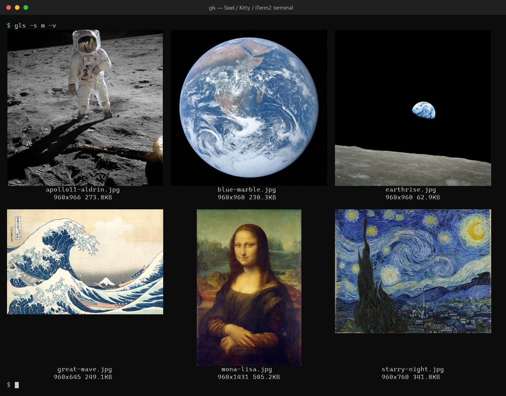

# gls

[English](README.md) | **日本語**

**画像のための `ls`。** フォルダの画像を、ファイル名つきのサムネイル一覧としてターミナルに表示します。
*`ls` for images — list and view images in your terminal as thumbnails.*

- 端末の画像プロトコル（**Sixel / Kitty / iTerm2**）で本物の画像を表示。非対応の端末では、**ハーフブロック**（TrueColor / 256色）、さらに**アスキーアート**へ自動でフォールバック
- PNG・JPEG・GIF・WebP・TIFF・BMP・**SVG**・**動画**・**PDF**・**HEIC** に対応
- 正規表現での絞り込み、並び替え、件数の制限、再帰、EXIF の向きの反映、`-vv` で EXIF などの詳細表示
- ファイル名を `Ctrl+クリック` で既定のアプリで開ける（OSC 8 ハイパーリンク）
- 並列デコード・先読み・キャッシュで、大量の画像でも速い
- Windows / macOS / Linux（WSL を含む）



<sub>画像プロトコルに対応した端末での `gls -s m -v`（文字ではなく本物の画像）。サンプルの6枚はパブリックドメインです（[docs/CREDITS.md](docs/CREDITS.md)）。この画像は `gls` の実際の出力から作ったもので、端末の画面を撮影したものではありません。</sub>

## インストール

### 1. Rust とリンカを用意する

gls は [Rust](https://rustup.rs/) でビルドします。Rust は OS のリンカを使うので、先にそれを入れます。

**macOS**

```bash
xcode-select --install                                          # Xcode コマンドラインツール（リンカ）
curl --proto '=https' --tlsv1.2 -sSf https://sh.rustup.rs | sh  # Rust
```

**Linux / WSL**（Debian / Ubuntu の場合。ほかのディストリビューションでは `build-essential` に当たるものを入れてください）

```bash
sudo apt install build-essential curl                           # C コンパイラとリンカ
curl --proto '=https' --tlsv1.2 -sSf https://sh.rustup.rs | sh  # Rust
```

**Windows**

```powershell
winget install Rustlang.Rustup
```

Windows の Rust には Visual Studio の C++ ビルドツールが必要です。入っていなければ `rustup` がインストールを案内するので、「C++ によるデスクトップ開発」を選んでください。

終わったら、`cargo` を PATH に通すためにターミナルを開き直してください。

### 2. gls をインストールする

```bash
cargo install --git https://github.com/equinox79/gls
```

ソースから:

```bash
git clone https://github.com/equinox79/gls
cd gls
cargo install --path .
```

### 3. 必要なら: 動画・PDF・HEIC 用のツール

画像と SVG は追加のツールなしで表示できます。動画・PDF・HEIC/AVIF にはサムネイルを作る手段が必要です（[対応形式](#対応形式)を参照）。

| OS | 標準で使えるもの | 必要に応じて入れるもの |
| --- | --- | --- |
| macOS | Quick Look が動画・PDF・HEIC に対応 | `brew install ffmpeg`（`-vv` で動画の詳細を出す場合） |
| Windows | エクスプローラーのサムネイルが動画・PDF に対応 | HEIC: Microsoft Store の「HEIF 画像拡張機能」。`winget install Gyan.FFmpeg`（`-vv` で動画の詳細を出す場合） |
| Linux / WSL | なし | `sudo apt install ffmpeg mupdf-tools`（動画と PDF）。HEIC/AVIF には ImageMagick 7（`magick` コマンド）か、HEIF を読める `ffmpeg` |

> Ubuntu の `imagemagick` パッケージはバージョン 6 で `magick` コマンドが無いため、gls からは使われません。

> **名前について:** macOS で Homebrew の `coreutils` を入れていると、GNU の `ls` が `gls` という名前で入っています。
> 衝突する場合は、`cargo install` のあとに実行ファイルの名前を変えるか、シェルでエイリアスを使ってください。

## 使い方

```bash
gls photo.jpg                      # 1枚を表示
gls ./*                            # カレントディレクトリの画像を、サムネイル一覧で表示
gls photos/ -s m                   # サムネイルを大きく
gls . -R -e '\.png$' --sort date -n 20   # サブフォルダも含めて、PNG を新しい順に20枚
gls ./* -vv                        # ファイル名の下に、形式・EXIF などの詳細も表示
```

- 画像を複数指定すると一覧になります。ワイルドカードやディレクトリも指定できます（PowerShell や cmd でも `*` が使えます）。画像以外のファイルは無視します。
- 出力が画面の高さを超えると、`more` と同じように1画面ごとに止まります（`Space`/`f`/`PageDown`: 次の画面、`Enter`/`j`/`↓`: 1行、`q`/`Esc`/`Ctrl+C`: 終了）。パイプやリダイレクトのときは止まらず全部出力します。
- 長いファイル名は、サムネイルの幅で最大3行まで折り返して表示します。3行に収まらないときは、最終行を `...png` のように拡張子を残して省略します。
- 端末の横幅に収まるだけ、サムネイルを横に並べます（`-g COLSxROWS` で列数を指定）。
- 表示に 0.15 秒以上かかるときは、標準エラー出力に `⠋ 読み込み中 12/86` のようなインジケータを出します（リダイレクト時は出しません）。

## オプション

### 絞り込み・並び替え

| オプション | 説明 |
| --- | --- |
| `-e`, `--regexp <REGEX>` | ファイル名（ディレクトリ部分を除く）を正規表現で絞り込む。複数指定すると、どれかに一致すれば表示。大文字小文字を無視するには `(?i)` を付ける（例: `-e '(?i)\.jpe?g$'`） |
| `-R`, `--recursive` | サブディレクトリも探す（`.git` などの隠しディレクトリは除く）。ファイル名の前に親ディレクトリ名も表示する |
| `--max-depth <N>` | サブディレクトリに入る深さ（`0`: 直下のみ、`1`: 1階層下まで）。指定すると `-R` がなくても再帰する |
| `--sort <KEY>` | `name`（既定。名前の昇順で、`img2` < `img10` のように数字は数値として比較）/ `date`（更新日時の新しい順）/ `size`（大きい順）/ `exif-date`（EXIF の撮影日時の新しい順。なければ更新日時）/ `none`（指定された順のまま） |
| `-r`, `--reverse` | 並び順を逆にする |
| `-n`, `--head <N>` | 並び替えのあと、先頭から N 枚だけ表示する |

### サイズ・レイアウト

| オプション | 説明 |
| --- | --- |
| `-s`, `--size <xs\|s\|m\|l\|xl>` | サイズのプリセット（既定: `s`）。単体表示は 24/40/80/120/160 文字幅、一覧はサムネイル1枚が 12/20/40/60/80 文字幅 |
| `-w`, `--width <N>` | 横幅を文字数で指定（`--size` とは併用不可）。一覧では全体の幅 |
| `-g`, `--grid <COLSxROWS>` | 一覧のグリッド。省略すると、端末の横幅に収まるだけ列数を増やす（行数は2）。`--width` だけを指定したときは `3x2` |
| `-v`, `-vv` | ファイル名の下に画像情報を表示。`-v`: ピクセルの縦横とファイルサイズ。`-vv`: さらに形式・色・画素数・縦横比・更新日・EXIF（カメラ、絞り・シャッター速度・ISO・焦点距離、撮影日、GPS の有無）。取得できない項目は省く |

### 描画

| オプション | 説明 |
| --- | --- |
| `-m`, `--mode <image\|half\|text>` | 描画モード（既定: `image`。使えない端末では下記のとおり自動でフォールバック） |
| `--protocol <auto\|sixel\|kitty\|iterm2>` | 画像プロトコルの指定（既定: `auto`） |
| `--cell-size <WxH>` | 文字セル1つのピクセルサイズ（例: `10x20`）。Sixel で画像と文字の位置がずれるときに調整する |
| `-p`, `--palette <NAME>` | `text` モードの文字セット: `standard` `block` `simple` `binary` `retro` `dots` |
| `--custom-palette <CHARS>` | 任意の文字セット（暗い → 明るい順。`--palette` より優先） |
| `-i`, `--invert` | 明暗を反転（`text` モード） |
| `--contrast <F>` / `--gamma <F>` | コントラスト・ガンマの補正（既定 `1.0`） |
| `--no-color` | カラーを使わない（モノクロの `text` モードになる） |
| `--no-links` | ファイル名にハイパーリンクを付けない |
| `--no-pager` | 画面に収まらなくても止まらない |

### キャッシュ

| オプション | 説明 |
| --- | --- |
| `--no-cache` | 描画キャッシュを使わない |
| `--clear-cache` | 描画キャッシュをすべて削除して終了 |

## 描画モードとフォールバック

デフォルトの `image` は、端末の対応に合わせて、次の順に自動で切り替わります。
デフォルトのときは黙って切り替わり、`-m image` を明示して使えなかったときだけ警告します。

1. **`image`** — Sixel / Kitty / iTerm2 が使える端末
2. **`half`（TrueColor）** — ハーフブロック `▀` で、1文字に上下2ピクセルを描く。TrueColor 対応の端末（Windows、`COLORTERM=truecolor`、既知の端末）
3. **`half`（256色）** — `TERM` が `*256color` の端末
4. **`text`（モノクロ）** — 文字の濃淡で描くアスキーアート。上記のどれでもない端末

同じフォルダを、画像プロトコルのない端末（`half`、左）と `-m text`（右、アスキーアート）で表示した例です。

| `half`（TrueColor） | `-m text` |
| --- | --- |
|  |  |

`-m half` / `-m text` を明示すれば、判定せずにそのモードで表示します。

画像プロトコルは、環境変数から自動で判定します。

| 端末 | プロトコル |
| --- | --- |
| Kitty、Ghostty | Kitty |
| iTerm2、WezTerm | iTerm2 |
| Windows Terminal（WSL 内も可、1.22 以降）、foot、mlterm | Sixel |

判定できない端末でも、`--protocol sixel` のように指定すれば使えます。tmux 経由では動かないことがあります。

## 対応形式

- **画像:** PNG・JPEG・GIF・BMP・WebP・TIFF・ICO・TGA・QOI。JPEG などの EXIF の向きは反映します。
- **SVG:** そのまま描画します（外部ツール不要。白背景。`<text>` の文字は描画されません）。
- **動画（mp4, mov, mkv, webm, avi, m4v, wmv, flv, mpg, 3gp）・PDF（1ページ目）・HEIC / HEIF / AVIF:** サムネイルを作れる環境が必要です。次の順に試します。
  1. **OS のサムネイル** — Windows はエクスプローラーと同じもの（動画・PDF は標準で、HEIC は Microsoft Store の「HEIF 画像拡張機能」を入れると対応）、macOS は Quick Look
  2. **外部ツール**（PATH に通っていれば使います） — 動画は `ffmpeg`、PDF は `mutool` → `pdftoppm` → ImageMagick、HEIC/AVIF は ImageMagick（`magick`）→ `ffmpeg`

  どれも使えないときは、そのセルを「(読み込み失敗)」にして、必要なツールを案内する警告を1回だけ出します。

## ファイル名のリンク

対応端末（Windows Terminal、iTerm2、WezTerm、Kitty、GNOME Terminal、VS Code など）では、ファイル名が
`Ctrl+クリック`（macOS は `Cmd+クリック`）で既定のアプリで開けるリンクになります（OSC 8 ハイパーリンク）。
出力が端末でないとき（リダイレクト・パイプ）は付けません。

WSL では、`/mnt/c/...` を `C:/...` に、それ以外を `\\wsl.localhost\<ディストリビューション>\...` 形式に変換して、Windows 側のアプリで開きます。

## 速さ

- 一覧は複数枚を並列にデコード・描画します。最初の1行ができたらすぐ表示を始め、数行先まで先読みします。
- JPEG は 1/2・1/4・1/8 に縮小しながらデコードします。一覧では、足りる大きさなら EXIF サムネイル（約160px）を使い、本体を読まずに済ませます。
- 描画結果をキャッシュします。画像のパス・更新日時・サイズと、表示設定が同じなら、2回目以降はデコードしません。
  - 保存先: Windows は `%LOCALAPPDATA%\gls\cache`、Linux / macOS は `~/.cache/gls/cache`（`XDG_CACHE_HOME` 優先）
  - 古いキャッシュは、1日に1回、起動時にバックグラウンドで整理します。最後に使われてから 30 日を過ぎたものと、合計 256 MB を超えた分（古い順）を削除します。環境変数 `GLS_CACHE_DAYS`（日数）と `GLS_CACHE_MAX_MB`（容量）で変えられます。

## 環境による注意

- `> file.txt` で保存するとき、Windows PowerShell 5 は UTF-16 で書き出します。UTF-8 にするには PowerShell 7 を使ってください。
- 旧 Windows コンソール（conhost）でも、ANSI の出力を自動で有効化します。ただし画像プロトコルは使えず、`half` で表示します。
- 出力が端末でないとき（パイプなど）は、横幅を環境変数 `COLUMNS` から取ります（なければ 80）。
- WSL の `/mnt/c` のように読み込みの遅い場所では、`-m half` や `-s xs` のほうが速くなります（EXIF サムネイルを使えるため）。

## 開発

```bash
cargo build --release
cargo test            # 単体テスト + tests/cli.rs（tests/data の小さな合成画像を表示）
cargo fmt --check
cargo clippy --all-targets -- -D warnings
```

ソースの構成:

| ファイル | 内容 |
| --- | --- |
| `src/main.rs` | 引数、入力の展開、並び替え、一覧の描画、ページャ |
| `src/gfx.rs` | Sixel / Kitty / iTerm2 の出力と端末の判定 |
| `src/ext.rs` | SVG・動画・PDF・HEIC の取得（OS のサムネイル、外部ツール） |
| `src/info.rs` | `-v` / `-vv` の画像情報 |
| `src/orient.rs`, `src/thumb.rs` | EXIF の向き、EXIF サムネイル |
| `src/link.rs` | ファイル名のハイパーリンク（OSC 8） |

## ライセンス

[MIT](LICENSE)
